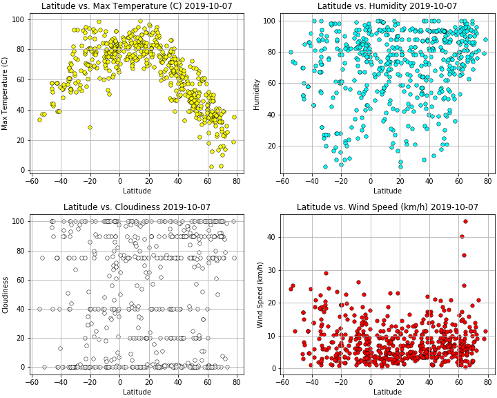

# WeatherPy

Randomly selects at least 500 cities utilizing (CitiPy)[https://github.com/wingchen/citipy]. Using the list of city names we just generated, request (OpenWeatherMapAPI)[https://openweathermap.org/api] for current weather information on cities. Store data into a dataframe and then plot the data onto a scatterplot.

## Hypothesis
There's a correlation between Latitude with Temperature, Humidity, Cloudiness and Windspeed. For example, as we near the equator, the temperature should be higher.

## Observation and Conclusion
* Based off the Latitude vs. Maximum Temperature plot, we can conclude that temperatures are highest nearest the equator.
* Based off the Latitude vs. Humidity plot, we can conclude that humidity is consistently high nearest the equator. However, we can also see that away from the equator, humidity will still vary from 0-100.
* As for Latitude vs. Cloudiness and Latitude vs. Wind Speed, it seems there is no correlation as cloudiness varies between 0 - 100 and wind speed roughly varies between 0 - 25 km/h across all latitude.

### Plots

